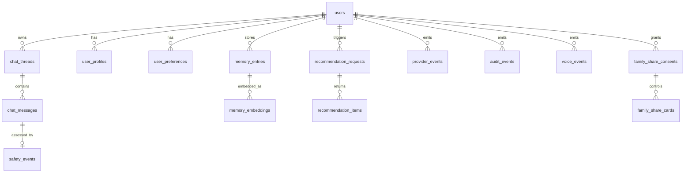

# CompanionHK Backend Database Schema

This document defines the production persistence schema for the FastAPI backend.

## Goals

- Support role-scoped continuity on (`user_id`, `role`, `thread_id`).
- Enable short-term memory via Redis TTL + long-term memory via Postgres.
- Keep schema RAG-ready with pgvector-backed retrieval tables.
- Keep memory writes and provider behavior auditable.
- Preserve privacy: do not store precise user current location for recommendations.

## Storage Layout

- `PostgreSQL`: durable entities, audit logs, recommendation history, long-term memory.
- `pgvector` extension: vector embeddings for retrieval memory.
- `Redis`: short-term turn window (`memory:short_term:{user_id}:{role}:{thread_id}`) with TTL.

## Entity Relationship Overview

## Core Tables

- `users`: primary user identity row (`user_id`).
- `chat_threads`: role-scoped thread identity; unique (`user_id`, `role`, `thread_id`).
- `chat_messages`: request/response message pairs and runtime/provider metadata.
- `safety_events`: per-message safety result (`risk_level`, `show_crisis_banner`).
- `user_profiles` + `user_preferences`: durable long-term profile memory.
- `memory_entries`: long-term write-audited memory records.
- `memory_embeddings`: pgvector embeddings with model metadata.
- `recommendation_requests`: request metadata with coarse user location only.
- `recommendation_items`: precise recommended place coordinates and rationale.
- `provider_events`: provider status/fallback telemetry.
- `audit_events`: explicit audit trail for memory writes and key operations.
- `voice_events`, `family_share_consents`, `family_share_cards`: extension-ready placeholders.

## Privacy Policy in Schema

- User recommendation requests persist:
  - coarse location token (`user_location_geohash`) and coarse region (`user_location_region`),
  - never raw request `latitude`/`longitude` when privacy flag is disabled.
- Recommended places persist precise location:
  - `recommendation_items.place_latitude`,
  - `recommendation_items.place_longitude`.

## Key Indexes and Constraints

- `chat_threads`: `uq_chat_threads_user_role_thread`.
- `chat_messages`: indexes by `thread_id + created_at`, `request_id`, and `user_id + role + created_at`.
- `memory_embeddings`: unique (`memory_entry_id`, `embedding_model`) + HNSW vector index.
- `recommendation_items`: `fit_score` check constraint (`0..1`).
- `provider_events` and `audit_events`: request/time-series index coverage for observability.

## Migration Workflow

From `backend/`:

- Create migration: `uv run alembic revision -m "describe change"`
- Apply migrations: `uv run alembic upgrade head`
- Roll back one revision: `uv run alembic downgrade -1`

Initial schema migration: `alembic/versions/8f327fc4442f_create_initial_schema.py`.
